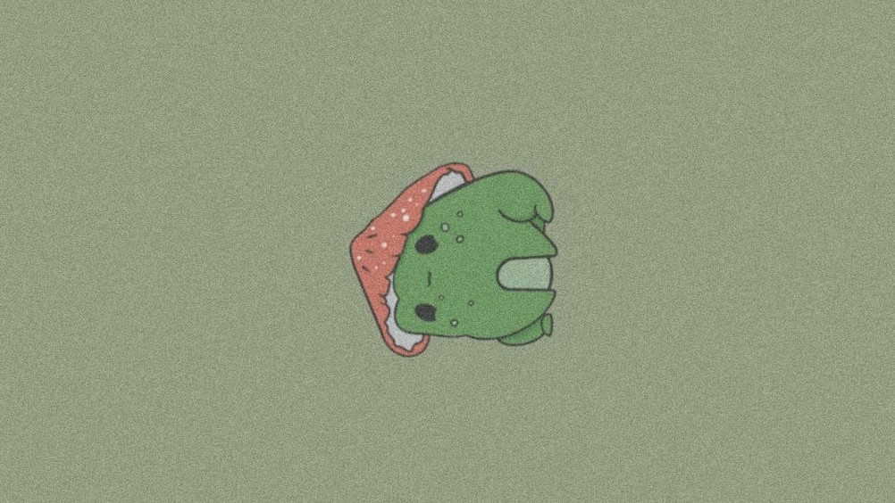
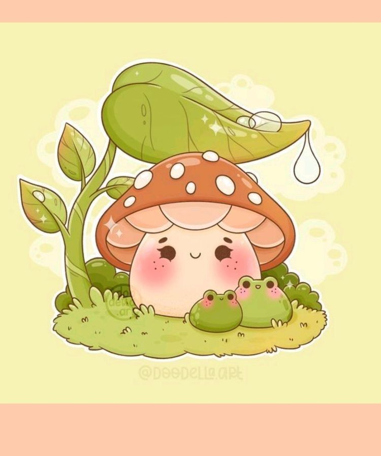
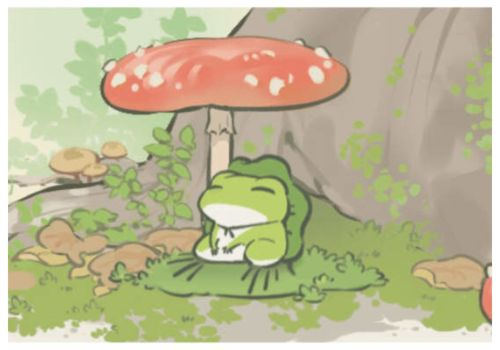
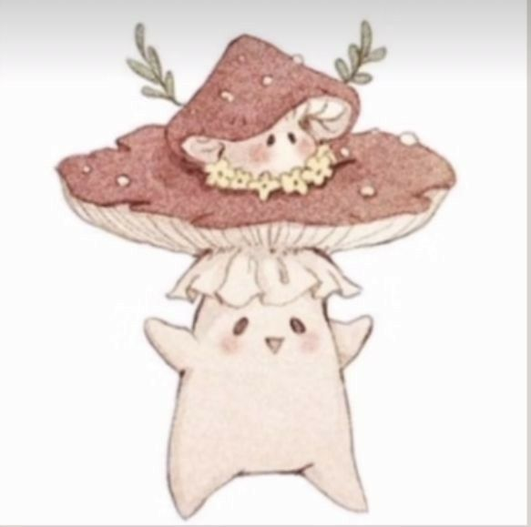

# EJERCICIO4
### 🐸Me gustan las ranas 🐸
#### Tienen algo especial, de hecho en el fondo de panatlla de mi escritorio tengo una rana muy bonita. Adjuntaré foto:

### Las ranas creativas con cabecita de champiñón me encantan, los champiñones y las imagenes llamadas "kawaii" logran en mí una especie de fantasia que envuelve a mi niña interior. 

### 💚Añadiré mas fotos que he encontrado en pinterest y que por supuesto ya están desde hace rato en mi biblioetca. 💚🌟

